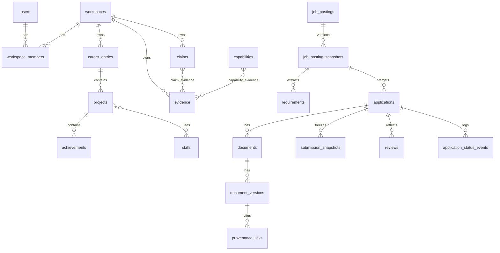

# 엔터티 관계

```
User 1---N WorkspaceMember N---1 Workspace
Workspace 1---N CareerEntry 1---N Project 1---N Achievement
Claim N---N Evidence
Capability N---N Evidence
Skill N---N Project
JobPosting 1---N JobPostingSnapshot 1---N Requirement
Application N---1 JobPostingSnapshot
Application 1---N Document 1---N DocumentVersion
DocumentVersion N---N SourceRevision  (through ProvenanceLink)
Application 1---N SubmissionSnapshot
Application 1---N Review
Application 1---N ApplicationStatusEvent
```



물리 스키마: `migrations/V1__initial_schema.sql`. 데이터 사전: [data-dictionary.md](data-dictionary.md).
